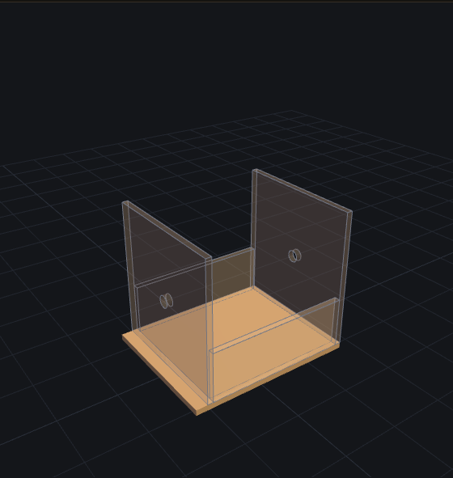
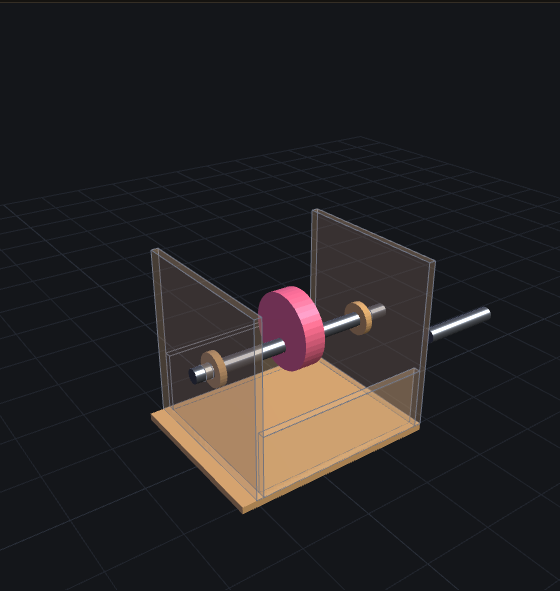
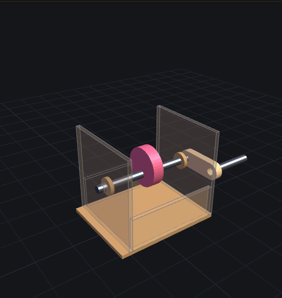
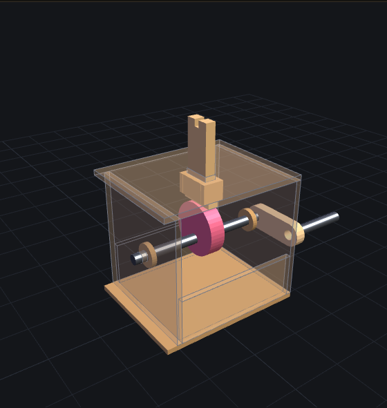
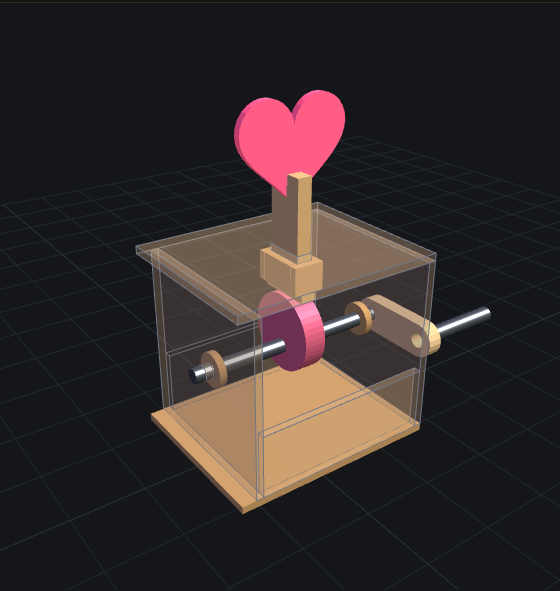

# 七夕心跳凸輪 · 組裝說明

一根手搖軸、一片偏心凸輪、一顆會跳的心。20 片 3mm 板 + 兩段 Ø6 圓棒,升程 12mm。
搭配 [3D 模擬](heart.html) 一起看:拉「爆炸圖」滑桿對照每一步,點「拆解接頭」看心和推桿怎麼咬合。

> 誠實聲明:本設計走完模擬三層驗證(幾何檢查/干涉掃描/零件自檢),**還沒實際切過**。
> 骷髏頭當初也是同樣狀態,後來線鋸切出來真的會動。你切了,歡迎回報。

## 第 0 步:列印與備料

- 列印描圖:印 [`cut/heart-cut-A4.pdf`](cut/heart-cut-A4.pdf)(一張 A4、1:1),縮放選「實際大小 / 100%」,**不要**選「符合頁面」。雷切:用 [`heart-cut-1.svg`](cut/heart-cut-1.svg) 或 [`heart-cut-1.dxf`](cut/heart-cut-1.dxf),黑線=切割、藍字=刻字。
- 印出後量左下角校正尺:**50mm 線段必須剛好 50mm**,不對就調印表機縮放重印。
- 材料:3mm 木板或厚紙板一張 A4 的量、Ø6 圓棒兩段(軸 92mm、手把 34mm;竹筷可替代,骷髏頭實作就是竹筷)、白膠、砂紙、一張紙條(第 5 步當墊片用)。
- 板材標 3mm 實際常是 2.8~3.2mm:疊層件黏完若超過 6.4mm,先磨薄再裝。
- 雷切的話:kerf 會讓配合再鬆 0.1~0.2mm,本設計全走「留隙+上膠」,鬆一點無害。
- **膠水用白膠(木工 PVA)就對了**:乾透後比木材本身還強,膠層薄不吃間隙。**不要用熱熔膠**黏配合面——膠層厚 0.5~1mm 會把留好的間隙全吃掉,受力久了還會剝。趕時間就用快乾木工膠。
- **圓棒/竹筷的黏合段先用砂紙磨毛**:竹子表面光滑,白膠咬不住,磨毛才牢(凸輪孔、軸環、曲柄孔、手把孔都適用)。

## 第 1 步:疊層件先黏

凸輪 3 片(疊 9mm)、推桿 2 片(疊 6mm)、曲柄臂 2 片(疊 6mm)各自疊黏。

- 黏之前拿一小段軸穿過孔當定位銷,孔對孔再壓合;曲柄臂兩孔都穿。
- 乾後把疊層邊緣磨齊,推桿四邊尤其要磨——它之後要在導套裡滑。

**驗**:凸輪穿軸能轉不晃;推桿厚度量起來 ≤6.4mm、寬度 ≤16.4mm。

## 第 2 步:側板立上底板

兩片側板(有 Ø6.2 軸孔的)立在底板上:**左側板距底板左緣 6mm、右側板外面距右緣 0(貼齊)**,軸孔同高同向,黏牢。
再把兩片**前後裙板**(74×26)卡進兩側板之間、貼齊底板前後緣黏好——結構閉環,箱體才不會左右歪斜。

**驗**:拿軸同時穿過兩孔,能自由轉、不彆手;抓住兩側板前後搖,不晃。

## 第 3 步:穿軸鏈(順序不能反)

軸從**左側板外**往內穿 → 套**左軸環** → 套**凸輪**(先不上膠) → 套**右軸環** → 穿出**右側板**。

- 凸輪推到正中:距兩側板內面各約 34mm。置中才有 ±1.5mm 的軸向容差,推桿不會踩空。
- 定位好後:凸輪中孔**整圈上白膠**(軸的這段先磨毛);兩枚軸環分別貼側板內側、黏在軸上(擋軸向滑動)。

**驗**:搖軸,凸輪跟著轉、軸不左右滑動。

## 第 4 步:曲柄與手把

曲柄臂套軸右端,與右側板**留 1~2mm 縫**再黏死;手把段插進臂另一端的孔黏牢。

**驗**:搖一整圈,曲柄與手把不掃到底板、不擦側板。

## 第 5 步:推桿與導套(最容易裝錯的一步)

1. 推桿 **T 腳朝下**立在凸輪正上方。
2. 頂板**先不上膠**,從桿頂套下(導槽對準桿身)。
3. 桿身**包一層紙**當墊片。
4. 四片導片貼著紙面靠緊:左右兩片夾窄邊、前後兩片擋寬邊,頂邊全部貼齊頂板底面,黏在頂板上。
5. 膠乾後**抽掉紙**——孔道位置準(推桿自己就是治具)、間隙也剛好(紙就是間隙)。

**驗**:手抽推桿上下要順滑;搖軸,推桿升降 12mm 不卡。**過了這關**才把頂板四邊上膠、蓋牢箱體。

## 第 6 步:裝心

心的底槽對準推桿頂端叉槽,往下沉到底(心槽頂面坐在叉槽底面),四面上白膠。
這是錯位搭接:心的槽壁跨住推桿(左右)、叉齒夾住心板(前後)、槽頂面定深(上下)。

**驗**:搖軸,心上下跳 12mm,四個接觸面都吃到膠。

## 第 7 步:調校

- 推桿桿身與凸輪頂面**磨圓、上蠟**(蠟燭塗一塗就行),滑起來才順。
- 回位靠自重就夠:偏心 6mm 要搖到約每秒 6 轉(386rpm)心才會跳離,手搖通常 1~2 轉/秒,餘裕三倍以上。
- 卡卡的:先查導套四面間隙(磨導片內側),再查凸輪有沒有置中。

## 最容易裝錯的五件事

1. 導片「靠緊黏」**沒墊紙** → 零間隙,100% 卡死
2. **先黏死頂板**才想放推桿 → T 腳穿不過導槽,順序不能反
3. T 腳**裝反朝上** → 沒有接觸面,心不會跳
4. 凸輪**沒置中** → 吃掉 ±1.5mm 軸向容差,推桿踩空
5. 曲柄臂**貼死側板** → 整圈摩擦,要留 1~2mm 縫

## 零件表

| 零件 | 外形 mm | 片數 |
|---|---|---|
| 底板 | 86 × 70 | 1 |
| 側板(含 Ø6.2 軸孔) | 70 × 72 | 2 |
| 前後裙板(閉環箱體) | 74 × 26 | 2 |
| 頂板(含推桿導槽) | 86 × 70 | 1 |
| 導片(圍成導套) | 16.6×12 ×2、12.6×12 ×2 | 4 |
| 偏心凸輪 R16 e6 | Ø32 | 3(疊 9mm) |
| 推桿(T 型腳+頂端叉槽) | 22 × 47 | 2(疊 6mm) |
| 心(底緣藏一道搭接槽) | 約 44 × 40 | 1 |
| 曲柄臂(兩端 Ø6.2 孔) | 14 × 42 | 2(疊 6mm) |
| 軸環 Ø14(孔 Ø6.2) | Ø14 | 2 |

另需:Ø6 圓棒兩段(軸 92mm、手把 34mm)、白膠。
