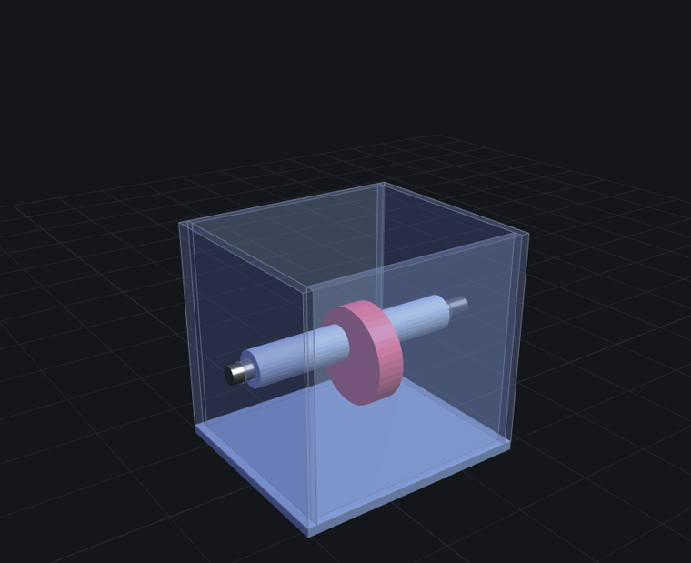
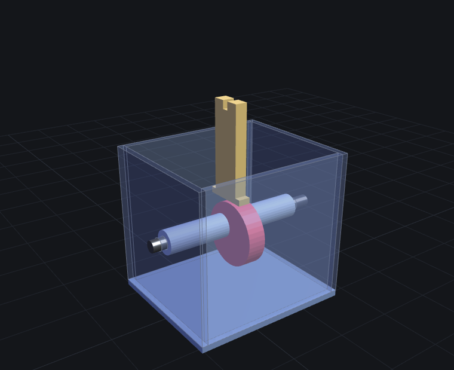
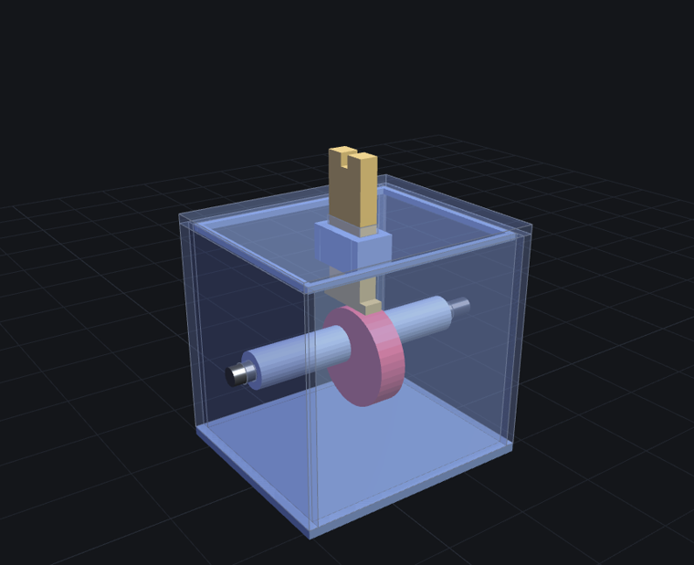
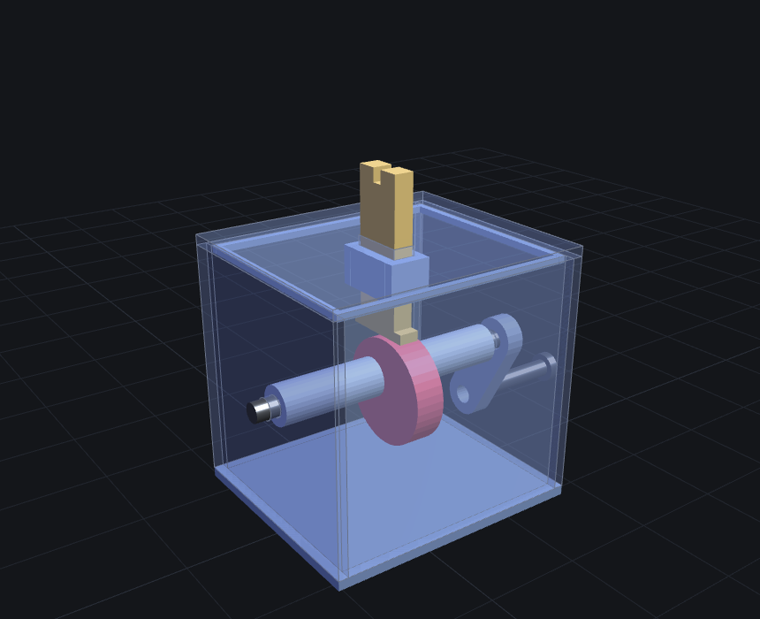
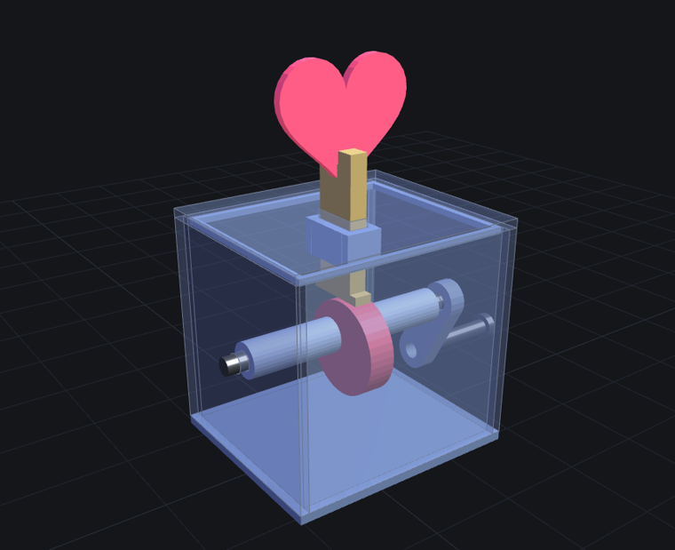

# 心跳凸輪 3D 列印版 · 組裝說明

9 種零件印 10 件,**全程免膠**,升程 12mm。
搭配 [3D 模擬](heart-print.html) 一起看:用「顯示/隱藏」藥丸對照每一步,拉「爆炸圖」看全部零件怎麼疊。

> 誠實聲明:本設計通過模擬三層驗證(逐項幾何檢查/干涉掃描/STL 水密核對),**還沒實際印過**。
> 木板版當初也是同樣狀態,後來線鋸切出來真的會動。你印了,歡迎回報。

## 第 0 步:列印與公差測試

- STL 都在 [STL 下載頁](print/):hp-01 到 hp-09,共 10 件(間隔套印 2 件),清單見 `MANIFEST.txt`。
- PLA、層高 0.2mm、3 層壁、15% 填充,全部平躺免支撐。列印方向照 [print/README.md](print/README.md) 的表。
- **先只印一件間隔套當公差測試**:軸(印出來的或 Ø6 圓棒)要能插進去「轉動不晃」。
  太緊就在切片軟體開 XY 孔補償 +0.1~0.2mm 重印,調到剛好,**再**印其餘零件。FDM 孔會縮,這步不能跳。
- 心那件換紅色料印。
- 不想印軸:Ø6 圓棒或竹筷可替代,但圓棒沒有 D 面,凸輪和曲柄就得各點一滴瞬間膠固定。

## 第 1 步:穿軸鏈

箱身頂是開的,凸輪和兩個間隔套先從頂口放進箱內。
軸從**右牆外**往內穿 → 箱內依序串:**右間隔套** → **凸輪**(D 孔對準軸的 D 面) → **左間隔套** → 穿出**左牆**。

- 凸輪 D 孔要對準 D 面再推,別硬壓,壓裂孔就要重印。
- 兩個間隔套把凸輪自動夾在正中,不用量尺寸。

**驗**:搖軸,凸輪跟著轉(D 面咬合,免膠);軸向左右推,游隙約 1mm、不會大幅滑動。

## 第 2 步:放推桿

推桿 **T 腳朝下**,立在凸輪正上方。

**驗**:推桿底面貼著凸輪頂,直立不歪。

## 第 3 步:蓋頂蓋

頂蓋的**導套對準推桿**從桿頂套下,四邊內唇對準箱口,壓到底。
(順序不能反:T 腳寬 22mm 穿不過導槽,**先放推桿才能蓋頂蓋**。)

**驗**:手抽推桿上下要順滑;搖軸,推桿升降 12mm 不卡。緊了磨唇外緣,鬆了唇上貼一圈紙膠帶。

## 第 4 步:曲柄與手把銷

曲柄的 **D 孔**壓上右邊露出的軸端,與右牆**留 1~2mm 縫**;手把銷(帽朝外)壓進曲柄另一端的孔。

**驗**:搖一整圈,曲柄和手把不掃桌面、不擦牆。

## 第 5 步:裝心

心的底槽對準推桿頂端叉槽,往下沉到底(槽頂面坐在叉槽底面)。
錯位搭接:心的槽壁跨住推桿(左右)、叉齒夾住心板(前後)、槽頂面定深(上下)。

**驗**:搖軸,心上下跳 12mm。配合太鬆會晃的話,叉槽裡點一滴瞬間膠,非必要。

## 調校

- 推桿桿身與凸輪頂面的層紋用砂紙輕磨,滑起來才順;乾性潤滑(蠟燭塗一塗)更好。
- 卡卡的:先查導套四面(磨推桿稜線),再查頂蓋有沒有壓到底。
- 回位靠心與推桿自重:手搖 1~2 轉/秒餘裕三倍以上,不需要彈簧。

## 最容易裝錯的五件事

1. **跳過公差測試**直接印全套 → 孔太緊全部重印
2. D 孔**沒對準 D 面硬壓** → 撐裂,凸輪報廢
3. **先蓋頂蓋才想放推桿** → T 腳穿不過導槽,順序不能反
4. T 腳**裝反朝上** → 沒有接觸面,心不會跳
5. 頂蓋**沒壓到底** → 導套懸空,推桿行程卡一半

## 零件表

| 檔案 | 零件 | 件數 |
|---|---|---|
| hp-01-body.stl | 箱身(底板+四牆,Ø6.6 軸孔) | 1 |
| hp-02-cap.stl | 頂蓋(含導套與壓入唇) | 1 |
| hp-03-cam.stl | 偏心凸輪 R16 e6(D 孔) | 1 |
| hp-04-spacer.stl | 間隔套 Ø12×32 | 2 |
| hp-05-follower.stl | 推桿(T 型腳+叉槽) | 1 |
| hp-06-heart.stl | 心 | 1 |
| hp-07-crank.stl | 曲柄臂(D 孔+手把孔) | 1 |
| hp-08-shaft.stl | 軸 Ø6×92(帶 D 面) | 1 |
| hp-09-handle-pin.stl | 手把銷 | 1 |

跟雷切幾何相同的「板件直印版」在 [STL 下載頁的 B 區](print/#flat),那個版本照[木板版組裝說明](heart-assembly.html)組,要上膠(PLA 用瞬間膠)。
